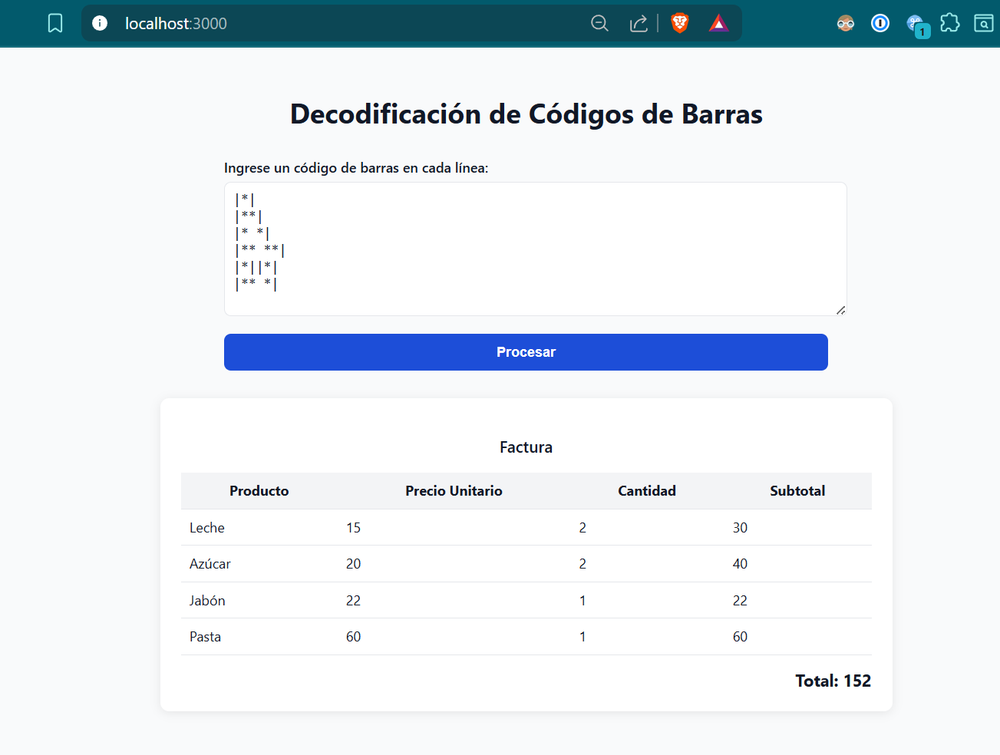

# 🧾 Decodificador de Códigos de Barras

Este proyecto es una aplicación web desarrollada con **Next.js** y **React** que permite decodificar códigos de barras personalizados, generando una factura con base en un catálogo de productos.

## 📸 Vista previa

---

## 🚀 Funcionalidad

Un supermercado utiliza un sistema de codificación basado en:

- **Barras (`|`)**
- **Estrellas (`*`)**
- **Espacios (` `)**

Cada combinación representa un código único que se decodifica según las siguientes reglas:

### 🔢 Reglas de decodificación

#### Barras (`|`)
- 1 barra: suma 5 al acumulado.
- 2 barras consecutivas: multiplica el acumulado por 3.
- 3 o más barras consecutivas: eleva el acumulado al número de barras consecutivas.

#### Estrellas (`*`) entre barras
- 1 estrella: suma 10.
- 2 estrellas consecutivas: multiplica por 2.
- 3 o más estrellas consecutivas: eleva al cuadrado.

#### Espacios (` `) entre barras
- 1 o más espacios: divide entre 2 y redondea hacia abajo.

---

By: Juan José Monsalve
